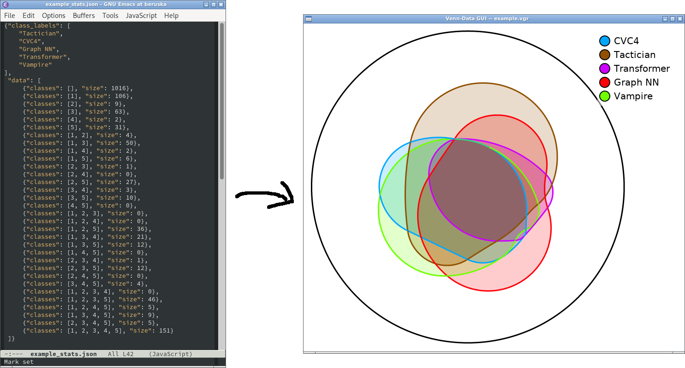
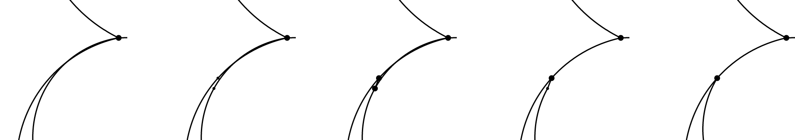
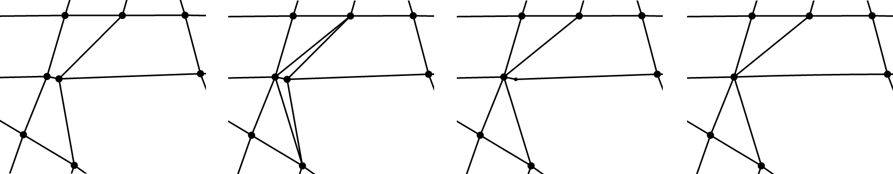

# VennData GUI
Turn your data into a Venn diagram!



## Features
+ interactive graph manipulation
+ gradient descend optimization
+ png, svg export

## Dependencies
+ Python3
+ [pyGtk3](https://pygobject.readthedocs.io/en/latest/getting_started.html)
+ [numpy](https://pypi.org/project/numpy/) (on Windows: "pacman -S mingw-w64-x86_64-python3-numpy")
+ [pytorch](https://pytorch.org/)

To try if everything is working, try to run
```
./venndata.py
```
or, to check if pytorch also works, run:
```
./venndata.py startpoint5.vgr -d example_stats.
```
and press the key 's'.

## Usage

To use the program to create a Venn diagram, you should go through the followinng steps:

1. Prepare the data in the json format such as in this [here](example_stats.json). You can do it manually, or use some json exporter in your language of choice.
2. (independently) Draw the basic skeleton graph, details about it are described in Section Graph Editing. You can also use prepared graphs for [2](startpoint2.vgr), [3](startpoint3.vgr), [4](startpoint4.vgr), [5](startpoint5.vgr) sets, and go directly to step 3. On the other hand, I recommend getting familiar with the graph editting controls before getting into more sophisticated setups with data included.
3. Include data into the graph by running `./venndata.py -d data.json`.
4. Try to manually approximatelly fit the graph to the data. The program will display green / red regions to signalize what should get smaller / bigger.
5. Use the gradient descend optimizer to fit the data (almost) perfectly, and also get smooth looking picture. This is still an interactive procedure where you can correct possible mistakes the optimizer could do.

## File handling

The app is always dealing with a single graph file -- by default `workdata.vgr`, however it can be specified as a command line argument (and is also shown in the window titlebar). This file is loaded on the start, and also can be reloaded when F3 is pressed (can be useful, especially since there is no undo). Key F2 saves the current graph back into the file. Because of the app's simplicity, it is recommended to use system tools to shuffle the files around (copying, renaming).

## Graph editing

The graph is mainly controlled by mouse
+ Use left button to add a new node on an edge / build a new connection from a node (this option gets disabled in with a face-selecting mode)
+ Drag with left button to move nodes / bend edges
+ Use wheel to zoom, and drag with middle button to move the view
+ Use right click to delete a node / an edge

It is however not supported to
+ have an edge with both endpoints in the same node,
+ have more than one component,
+ have a "bridge", an edge adjacent from both sides to the same face

### Graph cursor

The graph is internally stored as a planar graph with nodes, faces and edges, although this can get broken geometrically. To examine the graph structure, you can use arrows / keys '.', '?' which will show a purple graph cursor. To hide the graph cursor, and get back to graph editing, press SPACE.

### Region selection

After creating the graph, you need to specify which faces of the graph belong to which classes. Classes are numbered 1,2,..., and you can select the faces corresponding to face i by pressing the appropriate digit on the keyboard, and then selecting the faces corresponding to that class. Press SPACE to get back to the standard mode. It is also possible to edit the choice later / unselect faces from a class.
There is also the option to view the classes in a color mode enabled with the key 'v', you get back to the graph view by pressing 'g'. The colors of the Venn diagram view can be edited with a helper window opened on 'c'.

### Checking correctness

Press 'a' to analyze the graph validity (with output in the terminal), in particular if
1. There is a class combination missing.
2. If there is a node with incorrectly ordered edges (geometry not matching the topology). In that case graph cursor appears at the incorrect position..

## Fitting graph to data

Prepare a json file `data_file.json` like [this example](example_stats.json). Each datapoint corresponds to a single combination of classes, for example if there are five classes, the datapoint with classes `[2,3,4]` corresponds to the intersection of classes 2,3,4 minus the union of classes 1,5. The number of classes can be chosen, and the empty combination `[]` do not need to occur (it only disables the option of showing total area around).

After preparing a graph, save it (F2), close the app (Escape), and open the app again with an argument `-d data_file.json`. You can also try this right away by running.
```
./venndata.py startpoint5.vgr -d example_stats.json
```
The graph will be colored with red / green / blue. Green regions are too big, red regions too small, and blue regions should not exist (there is zero size as a datapoint). It is also possible to reorder the labels in the legend to find a more convenient initial setup.

I recommend first move the graph slightly to get an abstract idea of how the outcome could look like, and also to remove the blue regions via standard graph editing operations. I agree that the graph editing operations can be a bit unpractical, and they can break the class assignment, so it helps after such an modification to check whether the classes are correct by quickly going through them (1,2,..), or with the Venn view 'v'.

After removing all blue region, you can press 'a' again to check whether there are exactly the correct class combinations in the picture.

When the picture is getting into a shape, you can automate the graph tweeking process by pressing 's' (makes a gradient descent step towards the correct shapes), or Shift-S (also tries to minimize the edge lengths). However, these steps are not guaranteed to preserve planarity, so can be good be careful with them (at least at the beginning). When these optimizer tend to like overlapping, two edges a bit, I find it useful to just merge the two edges 



Similarly, you might want to contract an edge, if the nodes are too close, like this:



Instead of holding 's', or Shift-S, you can press 'o', or Shift-O with the same effect.

### Exporting

When the picture is ready, you can press final 'a' to check if everything is alright (it only doesn't check intersecting opposite edges, those must be verified manually), and press 'x' to export into png, or shift-X to export to SVG. Congratulations, you made your Venn diagram!
If the outer space (no classes) had a value in the data, you can display this with a circle or rectangle around by pressing 't'.

## Keyboard shortcuts summary

+ *Escape*: Exit the App
+ *'-'*, *'='*: change color sensitivity to area error
+ *Space*: Turn off the cursor / face selection
+ *F2*: Save to file
+ *F3*: Load form file
+ *'s'* / *'S'*: Gradient descent step
+ *'o'* / *'O'*: Repeat descent steps
+ *'a'*: Analyze graph correctness
+ *'v'*: Colorful view mode
+ *'g'*: Graph view mode
+ *'x'*, *'X'*: Export
+ *'c'*: Color selection
+ *'t'*: Show Outer space area
+ *'l'*: Disable / enable the legend
